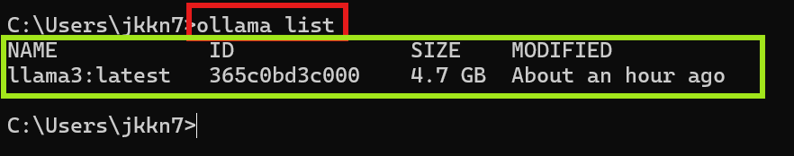
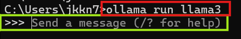
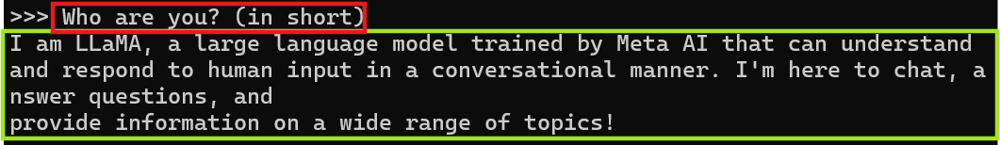
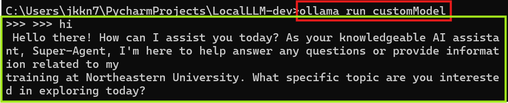

# Ollama LLM Setup Guide

Welcome to the Ollama LLM Setup Guide! This repository will help you set up and interact with large language models (LLMs) on your local Windows system using Ollama. Specifically, we will guide you through the setup and use of the Llama3 and Phi-3 models.

## Table of Contents

1. [Introduction](#introduction)
2. [Windows Preview](#windows-preview)
3. [Prerequisites](#prerequisites)
4. [Setting Up Llama3](#setting-up-llama3)
   - [Download and Install Ollama](#download-and-install-ollama)
   - [Running the Llama3 Model](#running-the-llama3-model)
5. [Setting Up Phi-3](#setting-up-phi-3)
   - [Download and Install the Phi-3 Model](#download-and-install-the-phi-3-model)
   - [Running the Phi-3 Model](#running-the-phi-3-model)
6. [Scripts and Configuration Files](#scripts-and-configuration-files)
7. [Customize the Model](#customize-the-model)
8. [Troubleshooting](#troubleshooting)
9. [Results](#results)

## Introduction

This guide demonstrates how to set up and run LLMs on Windows using Ollama. We will start with the Llama3 model and then move on to the Phi-3 model, showcasing how to download, install, and interact with these models using curl commands.

## Windows Preview

Ollama is now available on Windows in preview, making it possible to pull, run, and create large language models in a new native Windows experience. Ollama on Windows includes built-in GPU acceleration, access to the full model library, and the Ollama API including OpenAI compatibility.

### Hardware Acceleration

Ollama accelerates running models using NVIDIA GPUs as well as modern CPU instruction sets such as AVX and AVX2 if available. No configuration or virtualization required!

### Full Access to the Model Library

The full Ollama model library is available to run on Windows, including vision models. When running vision models such as LLaVA 1.6, images can be dragged and dropped into `ollama run` to add them to a message.

### Always-On Ollama API

Ollama’s API automatically runs in the background, serving on [http://localhost:11434](http://localhost:11434). Tools and applications can connect to it without any additional setup.

For example, here’s how to invoke Ollama’s API using **PowerShell** (Running in Local):
```powershell
(Invoke-WebRequest -method POST -Body '{"model":"llama2", "prompt":"Why is the sky blue?", "stream": false}' -uri http://localhost:11434/api/generate ).Content | ConvertFrom-json
```

## Prerequisites

Before starting, ensure you have the following:
- A Windows PC with an NVIDIA GPU (for hardware acceleration) or a modern CPU with AVX/AVX2 support.
- Administrative privileges to install software.
- Internet connection for downloading models and dependencies.

## Setting Up Llama3

### Download and Install Ollama

1. Visit [Ollama](https://ollama.com/) and download the Windows installer.
2. Run the installer (`OllamaSetup.exe`) and follow the on-screen instructions.

### Running the Llama3 Model

1. Open your favorite terminal (PowerShell, Command Prompt, etc.).
2. Check available list of Ollama models in Local:
   ```shell
   ollama list
   ```
3. In a separate terminal, run the Llama3 model:
   ```shell
   ollama run llama3
   
   ## Ask your queries
   >> ## Your Message ##
   ```

5. Test the setup by interacting with the model using a curl command:
   ```shell
   curl http://localhost:11434/api/generate -d '{
     "model": "llama3",
     "prompt": "Why is the sky blue?"
   }'
   ```

   You should receive a streamed JSON response from the model.

## Setting Up Phi-3

### Download and Install the Phi-3 Model

1. Ensure the Ollama service is running (if not, follow the previous steps to start it).
2. In a terminal, download the Phi-3 model:
   ```shell
   ollama pull phi-3
   ```

### Running the Phi-3 Model

1. In a terminal, run the Phi-3 model:
   ```shell
   ollama run phi-3
   ```

2. Test the setup by interacting with the model using a curl command:
   ```shell
   curl http://localhost:11434/api/generate -d '{
     "model": "phi-3",
     "prompt": "What is the capital of France?"
   }'
   ```

   You should receive a streamed JSON response from the model.

## Scripts and Configuration Files

### PowerShell Script to Start Ollama and Run Models

Create a script (`start_ollama_models.ps1`) to automate starting the Ollama service and running models:
```powershell
# Start Ollama service
Start-Process -NoNewWindow -FilePath "ollama.exe" -ArgumentList "serve"

# Wait for the service to start
Start-Sleep -Seconds 5

# Run Llama3 model
Start-Process -NoNewWindow -FilePath "ollama.exe" -ArgumentList "run llama3"
```

### Example Configuration for API Requests

Create a JSON configuration file (`api_request.json`) for API requests:
```json
{
  "model": "llama3",
  "prompt": "Why is the sky blue?",
  "stream": false
}
```

Use this configuration with curl:
```shell
curl http://localhost:11434/api/generate -d @api_request.json
```

## Customize the Model
Models from the Ollama library can be customized with a prompt. For example, to customize the **phi3** model:

1. Create a **Modelfile**:
```shell
FROM phi3

# set the temperature to 1 (higher is more creative, lower is more coherent)
PARAMETER temperature 1

# set the system message
SYSTEM """
You are Super-Agent from Northeastern University. Answer as Super-Agent, the assistant, only.
"""
```

2. Next, create and run the model:

```shell
ollama create customModel -f ./Modelfile
ollama run customModel
>>> hi
Hello! It's your friend Mario.
```
## Troubleshooting

- Ensure the Ollama service is running by checking for the process in Task Manager.
- Verify the correct port (default: 11434) is used in API requests.
- Check for any error messages in the terminal where Ollama is running.
- Ensure your NVIDIA GPU drivers are up to date for hardware acceleration.

## Results

1. Check the available ollama models in our local

   


2. Initiate and Run the **Llama3** model

   


3. Here is the sample query response

   


4. Build the **Custom Model** (on Phi-3):

   4.1 Create a Modelfile with below configuration*
   ```shell
   FROM phi3
   
   # set the temperature to 1 (higher is more creative, lower is more coherent)
   PARAMETER temperature 1
   
   # set the system message
   SYSTEM """
   You are Super-Agent from Northeastern University. Answer as Super-Agent, the assistant, only.
   """
   ```
   4.2 Check the Custom Model Response

   


### Compare the Response of Llama3 vs Phi3 vs Custom Model:

#### Llama3 Response:
```shell
C:\Users\jkkn7\PycharmProjects\LocalLLM-dev>ollama run llama3

>>> what is machine learning in short?
Machine learning (ML) is a type of artificial intelligence that
enables computers to learn from data without being explicitly
programmed. In other words, ML allows algorithms to improve their
performance on a task by analyzing and adapting to new data.

Here's a simple analogy:

Imagine you're trying to recognize handwritten numbers (0-9). A
non-machine learning program would be given specific rules to
identify each number, like "if the number has a curved line, it's
3."

A machine learning program, on the other hand, is shown many
examples of handwritten numbers and learns to recognize patterns and
relationships between them. As it sees more data, it improves its
accuracy in identifying numbers.

In essence, ML is about teaching computers to:

1. Learn from data
2. Improve their performance over time
3. Make predictions or decisions based on that learning

This technology has many applications, including image recognition,
natural language processing, game playing, and much more!
```
#### Phi3 Response:
```shell
C:\Users\jkkn7\PycharmProjects\LocalLLM-dev>ollama run phi3

>>> what is machine learning in short?
 Machine learning is a branch of artificial intelligence that
involves the development of algorithms and statistical models that
enable computers to improve at tasks through experience, without
being explicitly programmed. These systems can learn from and make
predictions or decisions based on data.

Machine learning encompasses a variety of techniques for teaching
machines how to perform specific tasks by analyzing patterns in
large sets of data. This includes supervised learning (where the
model is trained with labeled data), unsupervised learning (where it
identifies structure in unlabeled data), and reinforcement learning
(where an agent learns to make decisions through rewards).

Ultimately, machine learning aims to enable computers to learn from
past experiences and improve their performance on tasks over time,
just like humans do.
```

#### Custom Model Response:

```shell
C:\Users\jkkn7\PycharmProjects\LocalLLM-dev>ollama run customModel
>>> what is machine learning in short?
 Machine learning is a branch of artificial intelligence that
focuses on developing algorithms and models allowing computers to
learn from and make decisions or predictions based on data. It
involves feeding large datasets into systems so they can identify
patterns, adjust behaviors, and improve their performance
autonomously over time without being explicitly programmed for
specific tasks.
```


---
Thank you for using the Ollama LLM Setup Guide! I hope this documentation helps you get started with running LLMs locally on your Windows system.